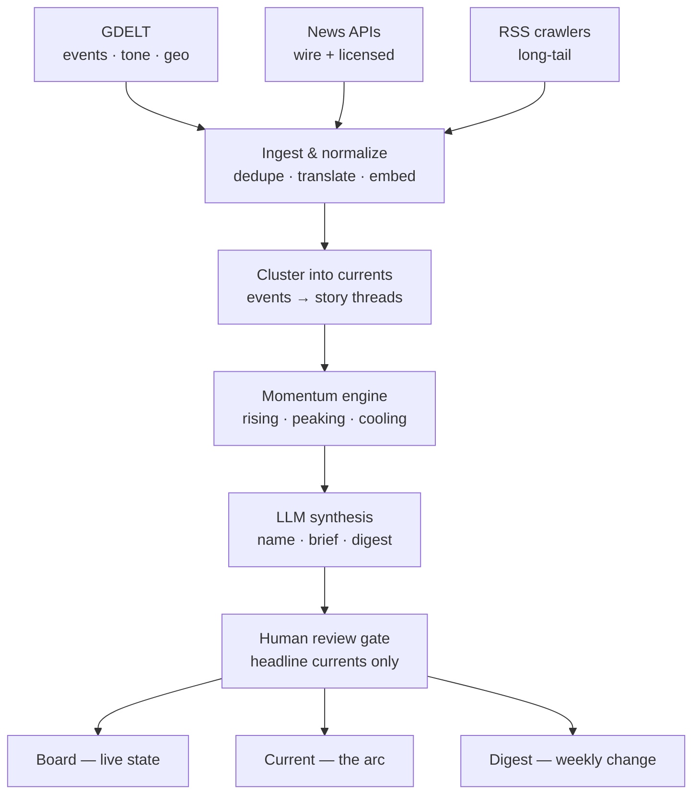

# Jetstream — Product & Engineering Spec

> **The world, zoomed out.** A calm, intelligent way to see where global news is actually heading — not more headlines, but the *currents* underneath and which way they're moving.

This is the single source of truth for building Jetstream. Pair it with the pitch deck (`Jetstream.pptx`) for the visual story. If you're an engineer or working in Claude Code: skim §1–3 for what we're building, then jump to **§8 (Build plan)** for the starting backlog.

*Status: concept + design complete (three UI mockups, pitch deck, pipeline architecture). No code yet — this doc is the brief to start from. All data in mockups is illustrative (June 2026).*

---

## 1. What we're building

A consumer news app that watches the whole world's news and surfaces the **10–15 macro "currents"** beneath it — flows of attention that actually shape the year. Each current shows not just *what's* happening, but **which way it's moving**: rising, peaking, or cooling.

- **The reframe:** not another feed. A *zoom-out button* — an antidote to overload and doomscrolling.
- **Positioning:** *calmer AND smarter*, not calmer-but-dumber. "Bloomberg's command of the big picture, with Calm's respect for your attention." The emotional target is **competence** (sharp, ahead, in control), not wellness.
- **Audience:** mass consumer who wants to feel on top of the world without the anxiety — **not** analysts/prosumers.
- **Visual language:** dark "intelligence terminal" aesthetic, sharp sans-serif, data-forward. (See §3.)

### The core loop — three views

| View | Question it answers | Job |
|------|--------------------|-----|
| **The board** (home) | What's the state of the world? | See all currents at a glance, ranked by momentum |
| **The current** (detail) | What's this one, and how did it build? | Understand one current in ~20s |
| **The digest** (weekly) | How did the world *move* this week? | A 3-minute ritual; retention engine |

State → understanding → change. The board shows *what is*; the digest shows *what changed*.

---

## 2. The three views (product spec)

The three reference mockups are interactive HTML/SVG inside a phone frame. Rebuild them from the behaviors below + the design system in §3.

### 2.1 The board — *state*
Home screen. Top to bottom:
- **Status/header + "today's read"** one-paragraph briefing.
- **Streamgraph** — 6 currents over ~8 weeks, centered baseline (flowing bands). Conveys magnitude (share) + movement.
- **Ranked list** of currents, each row: name, **momentum badge** (rising/peaking/cooling), sparkline, attention bar.
- **Weekly digest teaser** → links to the digest.
- **Tab bar:** Currents · Following · Digest · Search.

Principles: **10–15 currents max** (not hundreds of headlines); **momentum-first** (every current carries a direction); **ranked by movement**; **anti-bubble by default** — the home screen is always the whole world (personalization never hides it).

### 2.2 The current — *understand*
Drill-down for one current. Themed in that current's color (see §3).
- **Attention arc** — area/line chart of attention over ~6 months, with **numbered event markers** (1…5).
- **Brief** — plain language: "what's happening" + "why it matters".
- **Sourced timeline** — chronological nodes (oldest → newest), each with real source attributions; latest node highlighted. Numbered moments on the arc map to these nodes.
- **"How it's being covered"** — perspective split (stacked bar, e.g. 52/31/17). Computed from the *actual* distribution of coverage, not opinion.
- **"Alert me when this moves"** toggle (watch).

### 2.3 The digest — *change*
Weekly editorial ritual. Issue-numbered, ~3-min read.
- **Serif lede** — one sharp synthesis sentence (the one place serif is used, for editorial authority).
- **Reshuffle slope chart** — last-week rank → this-week rank for ~6 currents, lines colored by current. The signature "movement" visual.
- **Biggest movers** — top climber + top faller, one line each.
- **"What actually happened"** — 3 short synthesis blurbs (kicker + 2–3 sentences).
- **"What to watch next week"** — forward-looking bullets (the competence kicker).
- **By the numbers** — stat tiles (currents tracked / new threads / stories scanned).
- **CTA** → open the live board.

---

## 3. Design system

Dark "intelligence" theme. These are the exact tokens used across the mockups and deck — drop them straight into the client.

```css
/* Surfaces & text */
--bg:         #0E1116;  /* page background */
--card:       #171C24;  /* cards / panels */
--card-alt:   #13171D;  /* nested / alt panel */
--border:     #2C333D;  /* hairline on dark */
--ink:        #F2F4F7;  /* primary text */
--secondary:  #9BA3AF;  /* secondary text */
--muted:      #6B7480;  /* muted / captions */

/* Brand */
--brand-teal: #34D0BA;  /* chrome, digest, "alive" accents */

/* Status helpers */
--up-green:   #6FBF73;
--down-red:   #D08585;
```

**Per-current colors** (each current owns a hue; its detail screen is themed in it):

| Current | Hue | Hex |
|---------|-----|-----|
| AI governance | amber | `#F5A524` |
| Cost of living | coral | `#FB7A50` |
| Energy | teal | `#34D0BA` |
| Middle East | steel | `#7C9CC0` |
| China | blue | `#4EA8DE` |
| Climate | violet | `#8B7FE8` |

**Momentum encoding** (state → color + icon, using Tabler outline icons):
- `rising` → amber `#F5A524` + `ti-trending-up`
- `peaking` → coral `#FB7A50` + `ti-activity`
- `cooling` → steel/blue `#7C9CC0` + `ti-trending-down`

**Color logic (important):** brand teal = app chrome + the digest (brand-level surfaces). A current's own color = that current's detail screen. This lets the user know what "layer" they're on by color alone.

**Type:** sharp sans-serif throughout (the "competence" feel). Serif is used in exactly one place — the digest lede — for editorial authority.

---

## 4. Data pipeline architecture

Raw world news → a clear signal, in seven stages. The middle four are the automated engine; one human gate sits before publish; clients read from a published store.



**Stage by stage:**
1. **Collect** — GDELT (15-min global event feed: tone, geo, themes), licensed news APIs, RSS crawlers. Running 24/7.
2. **Ingest & normalize** — de-duplicate (wire republication, syndication), detect language, translate, extract entities/events, compute embeddings.
3. **Cluster into currents** — two levels: articles → *events*, events → *currents* (the macro threads). Cross-language. Tracks split/merge over time. *(Hard problem — §5.1.)*
4. **Momentum engine** — per current: volume, persistence, spread, acceleration → classify rising/peaking/cooling. *(Hard problem — §5.2.)*
5. **LLM synthesis** — name each current, write the brief, the timeline summaries, the "how it's covered" framing, and the weekly digest. Grounded in the clustered sources. *(Hard problem — §5.3.)*
6. **Human review gate** — editors verify the **headline currents only** (name, neutrality, facts) before publish. Quality gate that scales because the surface is small.
7. **Serve** — published "currents" objects land in a read-optimized store; the three client views read from there.

---

## 5. The three hard problems

This is where the real engineering risk lives. Each has a concrete first move that keeps v1 tractable.

### 5.1 Clustering — defining a "current" and keeping its identity over time
Two-level clustering: embed articles → group into **events** (dedupe syndication/translation), then group events into a larger **story thread = current**. The hard part isn't static classification — it's **identity over time**. Currents *split* (Middle East → "Gaza" + "Iran"), *merge* (separate "EVs" and "grid" become one flow), and *go dormant*. So:
- Use **online clustering**, not batch — assign each new item to existing events/currents or spawn new ones.
- Give every current a **stable ID**, and record **split/merge as explicit events**. The digest's "last week → this week" comparison depends on this stability.
- **v1 simplification:** humans curate the ~10–15 headline currents so IDs stay stable; widen automation as accuracy proves out.

### 5.2 Momentum — what counts as a "trend"
Naive "article volume spiked → trending" gets fooled by one-off spikes. Combine four defensible signals:
- **Volume** — article count in the window.
- **Persistence** — how many days it's been sustained.
- **Spread** — number of countries / outlets it's reached (geographic + source breadth).
- **Acceleration** — 1st/2nd derivative of volume.

Classify the trajectory shape into `rising` (accelerating), `peaking` (high but flattening), `cooling` (decelerating). The point is distinguishing a **one-time spike** from **steady accumulation** — the product teaches this distinction in plain language (e.g. "no dramatic event — just steady accumulation over four weeks").

### 5.3 LLM neutrality + human gate
If summaries lean, trust collapses. So the LLM does **grounded, structured generation only**, never free generation:
- Names, briefs, and timelines are drawn **only from the clustered source articles**, with a **source cited per item**.
- "How it's being covered" is **computed from the real coverage distribution**, not the model's opinion.
- A **human review gate** sits on top: editors check the headline currents for name, neutrality, and facts before publish. Full review is impossible, so the surface is deliberately small (top 10–15) — quality and scale at once.

---

## 6. Data model

Five separable stores. The client never touches the pipeline — it reads only the published `CurrentView` / `Digest` objects.

```ts
// Raw + normalized article
interface Article {
  id: string;
  url: string;
  source: string;            // outlet / domain
  publishedAt: string;       // ISO
  language: string;
  title: string;
  body: string;              // normalized text
  titleTranslated?: string;
  embedding: number[];       // vector (pgvector)
  eventId?: string;          // assigned event cluster
  countries?: string[];      // GDELT geo
  tone?: number;             // GDELT tone
}

// A discrete happening (cluster of articles)
interface Event {
  id: string;
  currentId?: string;        // parent current
  summary: string;
  firstSeen: string;
  lastSeen: string;
  articleCount: number;
  countries: string[];
  centroid: number[];        // embedding centroid
}

// The macro thread — STABLE identity over time
interface Current {
  id: string;                // stable across weeks
  name: string;              // LLM-named, human-approved
  colorKey: string;          // design token key, e.g. "ai-governance"
  status: "active" | "merged" | "dormant";
  mergedInto?: string;
  createdAt: string;
}

// Momentum time-series (e.g. one row per current per day)
interface MomentumPoint {
  currentId: string;
  t: string;                 // bucket timestamp
  volume: number;
  persistence: number;       // days sustained
  spread: number;            // #countries or #sources
  acceleration: number;
  score: number;             // composite
  state: "rising" | "peaking" | "cooling";
}

// PUBLISHED, read-optimized object the client reads (denormalized)
interface CurrentView {
  id: string;
  name: string;
  colorKey: string;
  rank: number;
  state: "rising" | "peaking" | "cooling";
  arc: { t: string; value: number }[];                 // attention over time
  brief: { whatsHappening: string; whyItMatters: string };
  timeline: { date: string; text: string;
              sources: { outlet: string; url: string }[] }[];
  coverage: { buckets: { label: string; pct: number }[] }; // "how it's covered"
  reviewedAt: string;
  reviewedBy?: string;
}

interface Digest {
  issue: number;
  weekOf: string;
  lede: string;
  reshuffle: { currentId: string; name: string; colorKey: string;
               lastRank: number; thisRank: number }[];
  movers: { climberId: string; fallerId: string };
  blurbs: { kicker: string; body: string }[];
  watchNext: string[];
  stats: { currentsTracked: number; newThreads: number; storiesScanned: number };
}
```

**Storage note:** for MVP, a single **Postgres** instance covers most of this — relational tables for articles/events/currents, **pgvector** for embeddings (clustering + search), and **TimescaleDB** (or a plain time-bucketed table) for `MomentumPoint`. The published `CurrentView`/`Digest` can live in the same DB (read-optimized table) or a cache. Decouple later if scale demands.

---

## 7. Suggested tech stack & repo structure

*A reasonable default — not mandates. Adjust to team familiarity.*

- **Pipeline / engine:** Python (best fit for embeddings, clustering, LLM orchestration). Scheduled workers (cron → queue as it grows).
- **Embeddings:** a sentence-embedding model (hosted or self-served).
- **LLM synthesis:** Anthropic Claude API (model string e.g. `claude-sonnet-4-6` for cost/latency; verify current models in the docs).
- **Datastore:** Postgres + `pgvector` (+ TimescaleDB for momentum).
- **Serving API:** thin REST/GraphQL reading the published store.
- **Client:** Next.js (web first — MVP is English/web), charts hand-built in SVG/D3 to match the mockups. React Native later for native apps.

```
jetstream/
  pipeline/                 # Python data engine
    ingest/                 # gdelt.py, news_api.py, rss.py
    normalize/              # dedupe, lang_detect, translate, embed
    cluster/                # event_clustering, current_clustering (split/merge)
    momentum/               # scoring + state classification
    synthesis/              # LLM prompts: name, brief, timeline, digest
    review/                 # human review queue + tooling
    db/                     # schema.sql, migrations, models
  api/                      # serving layer (reads currents store only)
  web/                      # Next.js client
    app/board/              # the board (home)
    app/current/[id]/       # the current (detail)
    app/digest/[issue]/     # the digest (weekly)
    components/charts/      # streamgraph, arc, slope chart
  shared/                   # types (mirror §6), design tokens (§3)
```

---

## 8. Build plan (phased) — **start here**

Maps to the deck's roadmap: **Prototype → MVP → Expand**. Each phase has a concrete backlog.

### Phase 0 — Thin slice (prove the concept on real data)
One vertical (e.g. geopolitics), GDELT only, currents mostly hand-curated. Goal: *does the concept hold up on real data?*

- [ ] Scaffold repo + Postgres with `pgvector`; define schema from §6.
- [ ] GDELT collector for one vertical → `Article` rows.
- [ ] Normalize: language detect + embeddings; basic dedupe.
- [ ] Seed a `currents` table with ~10 hand-picked currents + `colorKey`.
- [ ] Assign articles/events to currents (semi-manual rules + embedding similarity).
- [ ] Momentum v0: volume + persistence over a daily time bucket → `state`.
- [ ] Next.js **board** screen reading from a published `CurrentView` table (streamgraph + ranked list).
- [ ] **Current detail** screen (arc + brief + timeline) — brief/timeline can be hand-written first.
- [ ] **Digest** screen (manual issue) — to validate the format.

### Phase 1 — Real engine (the MVP)
Two verticals (geopolitics + tech), automated.

- [ ] Online event + current clustering with stable IDs.
- [ ] Momentum full: add spread + acceleration; tune state thresholds.
- [ ] LLM synthesis: name, brief, timeline, "how it's covered", weekly digest — grounded + cited.
- [ ] Human review queue (gate the ~10–15 headline currents before publish).
- [ ] Automated weekly digest generation (reshuffle from week-over-week ranks).
- [ ] English first; Korean next. Watch/alerts.

### Phase 2 — Expand
- [ ] More sources (news APIs, RSS breadth) + more languages.
- [ ] Automate split/merge detection.
- [ ] Personalization that **never** hides the whole-world board.
- [ ] Scale ingestion + decouple stores as needed.

---

## 9. MVP scope (in / out)

**In the MVP**
- 2 verticals to start (geopolitics + technology)
- GDELT + 2–3 quality news APIs
- All three views (board, current, digest)
- English first (then Korean)
- Human-in-loop on the headline currents
- The weekly digest ritual

**Deliberately later**
- Full multilingual coverage
- Causal links between currents
- B2B / data API
- Deep personalization
- Native-app polish
- Fully automated currents end-to-end

---

## 10. Open decisions

- **Product name** — "Jetstream" is a placeholder.
- **Exact launch verticals** — geopolitics + tech assumed; confirm.
- **Build vs. buy on clustering** — custom online clustering vs. an off-the-shelf topic/event service.
- **Embedding + LLM providers** — pick and pin versions.
- **How many currents** — 10 vs 15 on the board; how many headline currents get human review.
- **Monetization timing** — consumer subscription + wellness wedge; B2B engine later (don't over-build early).

---

## Appendix — sample/illustrative data

Used in the mockups; handy as seed data. June 2026 frame.

| Current | colorKey | State (example) |
|---------|----------|-----------------|
| AI governance | `ai-governance` | rising |
| Cost of living | `cost-of-living` | peaking |
| Energy | `energy` | rising |
| Middle East | `middle-east` | cooling |
| China | `china` | steady |
| Climate | `climate` | rising |

Example digest reshuffle (last → this week): AI governance 3→1, Cost of living 1→2, Energy 4→3, Climate 6→4, Middle East 2→5, China 5→6.
